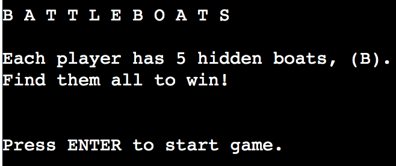
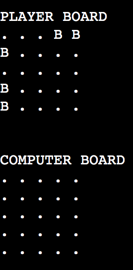
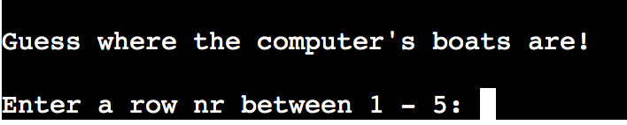
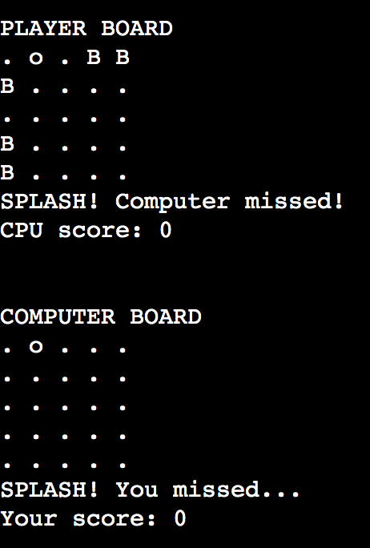
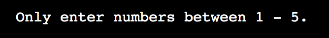
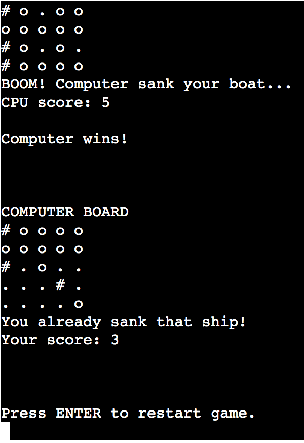
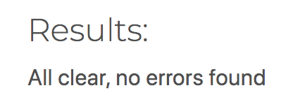

# BATTLEBOATS

Battleboats is a terminal game written in Python, running in Code Institute's mock terminal on Heroku.
The user is tasked to find the hidden boats on the computer's game board before the computer can find the boats on the players board.

[Live link to app >](https://battleboats-2.herokuapp.com/)

## Table of contents
1. [How to play](#how-to-play)
2. [Graphics](#graphics)
3. [Features](#features)
4. [Existing features](#existing-features)
5. [Future (possible) features](#future-possible-features)
6. [Data Model / Structure](#data-model--structure)
7. [Development](#development)
8. [Testing](#testing)
9. [Bugs](#bugs)
10. [Remaining bugs](#remaining-bugs)
11. [Validator testing](#validator-testing)
12. [Deployment](#deployment)
13. [Credits](#credits)

 
 

## How to play

Battleboats is a variant of the classic board game Battleships. This version features boats which are only one square in size and are randomly placed on both players' boards.

The player is only able to see the position of their own boats, while the computer's boats are invisible.

Each turn starts with the player making a guess on where the computer's boats are hidden, then the computer makes a guess on the player's boats.
If a boat is found, it is "sunk". First side to find all the opponent's boats wins!
 
 

## Graphics

These are the symbols used in the game:

<code>. . . . .&nbsp;&nbsp;</code> Game board positions

<code>B&nbsp;&nbsp;</code> Boat 

<code>o&nbsp;&nbsp;</code> Missed shot 

<code>#&nbsp;&nbsp;</code> Hit / sunk boat 
 
 

## Features

### Existing Features
 

- Welcome screen
    - User is told the name and goal of the game
    - Number of hidden ships are shown to the user
    - User can start game by pressing ENTER
 
 

- Randomly generated game boards
    - Boats are placed in random positions on each board
    - The boats are hidden to the opponent
 
 

- User input prompt
    - User is asked to input row and column number of the computer's board
    - input is analyzed, feedback is given to the user
    - Computer automatically makes it's move after the player
 
 

- Feedback to user
    - User is shown the result of the last round through text
    - Game boards are redrawn to display the latest moves
    - Player and computer scores are updated
    - Any invalid input detected makes an error message appear
 
 

- Input validation and error-checking
    - User can only enter numbers
    - Only coordinates within the game board are allowed
    - Already sunk boats cannot be attacked again
    - User must enter a valid input to continue the game
 
 

- Game over screen
    - When either side sinks all the opponent's boats, the game is stopped and the winner is presented
    - User can press ENTER to restart the game
 
 
### Future (possible) Features
- Allow the player to input their own name
- Allow the player to set the board sizes (code is built to implement this easily)
- Include larger boats
 
 

## Data Model / Structure

The game uses a `Gameboard` class for it's model. Two instances are created which draws three game boards: One for the player and two for the computer (one of which is invisible to the user). 

The Gameboard class is used to store and process most of the data within the game, such as board size, number and position of boats, and the current state of each game board.

The computer uses two boards, since the invisible board is used to store the boat positions, while the visible board is used to display the hits and misses to the user. The Gameboard class har methods for checking for hits on one board and drawing them on the other.

The class uses the `make_board()` method to draw the board and place the boats at the beginning of the game, while the `redraw_board()` method checks for hits/misses, updates all boards each turn, displays gameplay messages and counts scores. 

Input prompts, validation and computer guesses are all handled within the main gameplay loop of the `new_game()` function.

 
 

## Development

- Development was started by making a rough skeleton sketch of the needed logic and functions. This was made using comments in GitPod.
- After the skeleton was deemed complete, each of the parts were coded individually, starting with the code for drawing the game board.
- Finished and working code blocks were restructured into either the Gameboard class or the new_game() function to improve code legibility and future expandability.
- Thought has been put into making the code flexible, for example are the board sizes and boat numbers defined by a single value (`size`), which makes it easy to modify the game.

 
 
    
## Testing

The app was manually tested with the following methods:
- The code passed through the [CI Python Linter](https://pep8ci.herokuapp.com/) without any problems.
- A number of possible invalid inputs has been repeatedly given to ensure error handling and validation works as intended.
- App was tested on a local GitPod terminal and on the deployed Code Institute Heroku terminal.
 
 

### Bugs

Solved Bugs

- During development, the random boat placement could sometimes choose the same position twice, resulting in fewer boats on the board. This was solved using a counter which checks that the correct number of boats has been placed.
- Similarly, the computer would sometimes attack the same coordinates repeatedly. This was fixed using a list which records the places the computer has attacked previously.
- User was able to input '0,0' as coordinates, resulting in an attack on '5,5'. This was caused by the wrong number range setting on the checker for valid inputs.
 
 

### Remaining Bugs

- No remaining bugs
 
 

### Validator testing

- Code Institute PEP8 Python Linter
    - No errors were found from [CI Python Linter](https://pep8ci.herokuapp.com/)
 
 

## Deployment

The Battleboats app was deployed using GitHub and Code Institute's mock terminal for Heroku.
- How to deploy:
    - Fork or clone the repository on GitHub
    - Set up a new Heroku App
    - Set the Config Vars as `PORT` and `8000`, for `KEY` and `VALUE`, respectively
    - Choose `Python` and `NodeJS` as buildbacks, in that order.
    - On the Deploy tab, connect to GitHub, select your repository and click "Deploy Branch"
    - A link to the live project will appear when the process is finished
 
 

## Credits

- Deployment terminal was built by Code Institute
- Inspiration for general code function was taken from: [https://codereview.stackexchange.com/questions/232013/a-simple-battleship-game](https://codereview.stackexchange.com/questions/232013/a-simple-battleship-game)
- Project was coded by Jonatan Knut von Sydow in february 2023, as a part of the Full Stack Developer Programme at Code Institute
 
 
